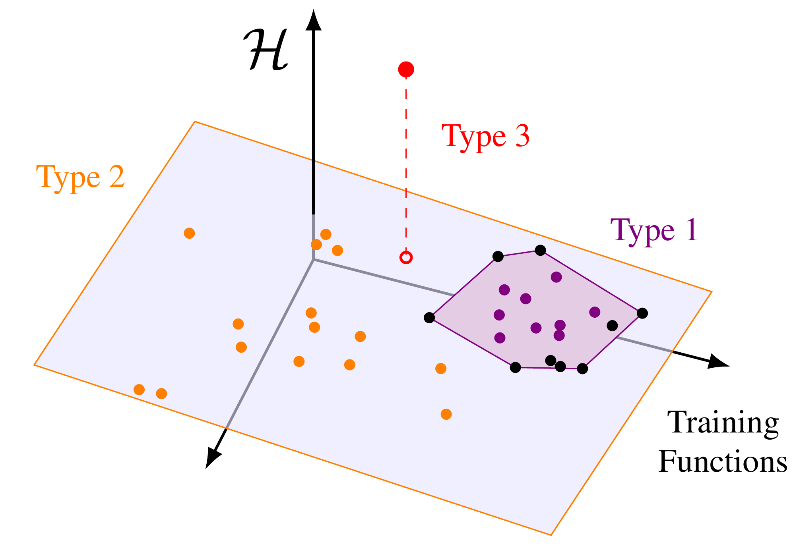
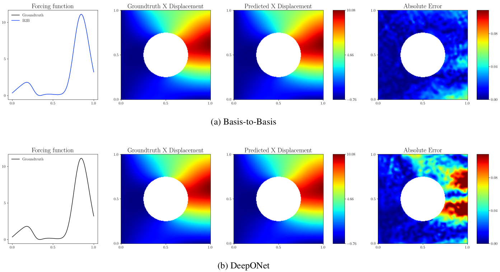
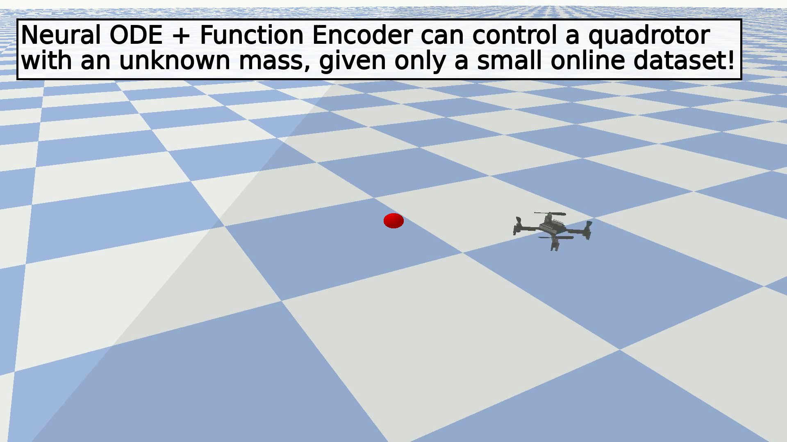
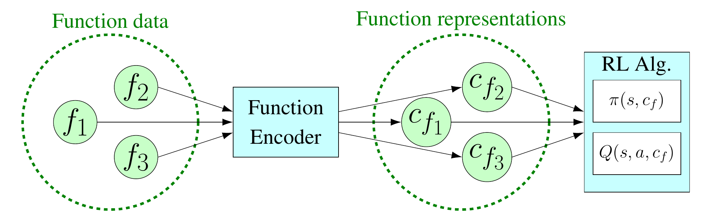

---
# Feel free to add content and custom Front Matter to this file.
# To modify the layout, see https://jekyllrb.com/docs/themes/#overriding-theme-defaults
layout: home
---

        

 
 

Hello, and welcome to my site! I am a third year PhD student at the University of Texas at Austin working with Dr. Ufuk Topcu. I previously received my BS in computer engineering from Iowa State University. My recent research is in reinforcement learning and transfer learning. In particular, I have been applying the logic of Hilbert spaces to machine learning problems, and I have found it to be an excellent approach to achieving transfer in all sorts of problems!

<html lang="en">
<head>
    <meta charset="UTF-8">
    <meta name="viewport" content="width=device-width, initial-scale=1.0">
    <title>My Projects</title>
    
</head>
<body>
    <h1>Selected Publications</h1>
    

        

            
            

                <h3><a href="https://tyler-ingebrand.github.io/FunctionEncoderRL/">Function Encoders: A Principled Approach to Transfer Learning in Hilbert Spaces [Under Review]</a></h3>
                
 We introduce several improvements to the function encoder algorithm, prove a universal function space approximation theorem for function encoders, and demonstrate that the function encoder outperforms SOTA on several inductive transfer learning tasks.

            

        

        

            
            

                <h3><a href="https://tyler-ingebrand.github.io/OperatorFunctionEncoder/">Basis-to-Basis Operator Learning Using Function Encoders [CMAME 2024]</a></h3>
                
Basis-to-Basis operator learning is a novel method based on learned basis functions that achieves state-of-the-art performance in operator learning tasks.

            

        

        

            
            

                <h3><a href="https://tyler-ingebrand.github.io/NeuralODEFunctionEncoder/">Zero-Shot Transfer of Neural ODEs [NeurIPS 2024]</a></h3>
                
This work combines the recent advances in learned basis functions with neural ODEs,
                allowing for online transfer of learned system models at execution time without retraining.

            

        

        

            
            

                <h3><a href="https://tyler-ingebrand.github.io/FunctionEncoderRL/">Zero-Shot Reinforcement Learning via Function Encoders [ICML 2024]</a></h3>
                
By representing the context of a reinforcement learning problem using function encoders, basic reinforcement learning algorithms can achieve excellent zero-shot transfer in multi-task, multi-agent, and hidden-parameter reinforcement learning problems.

            

        

        
    

</body>
</html>